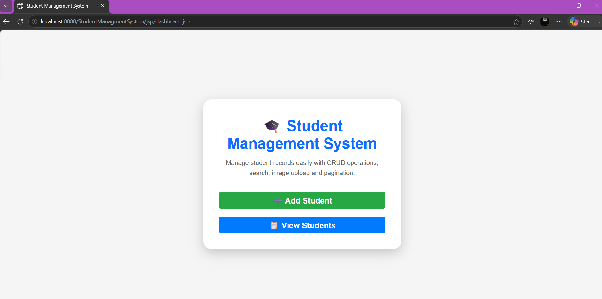
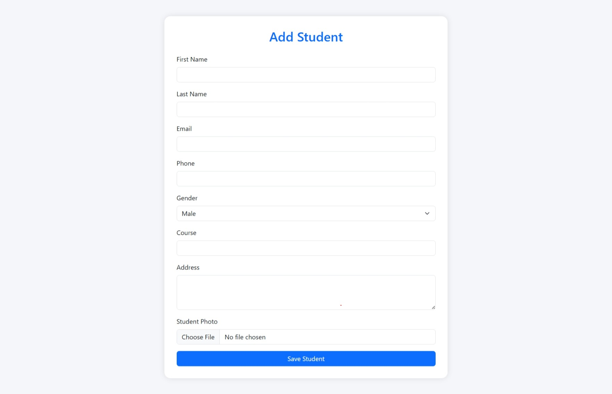
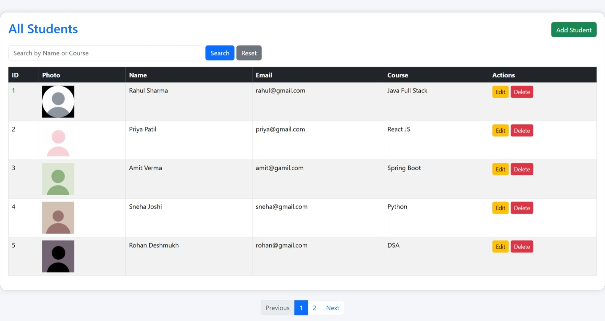
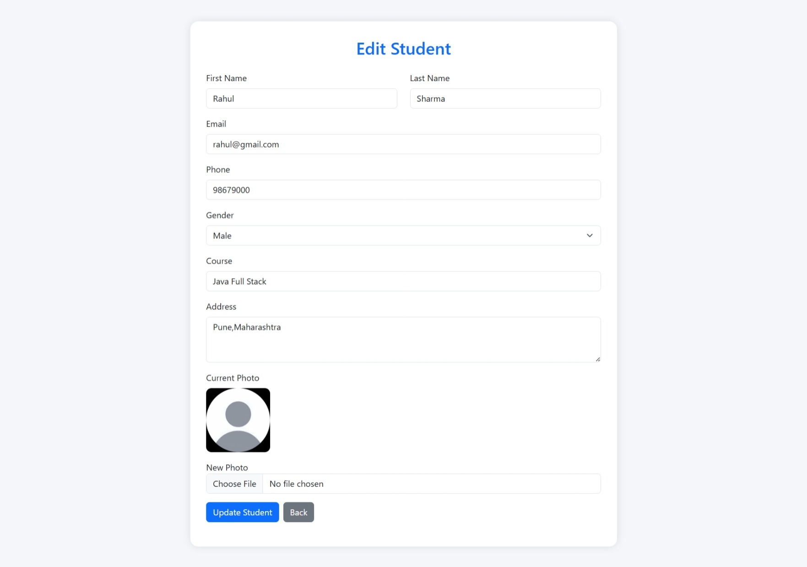
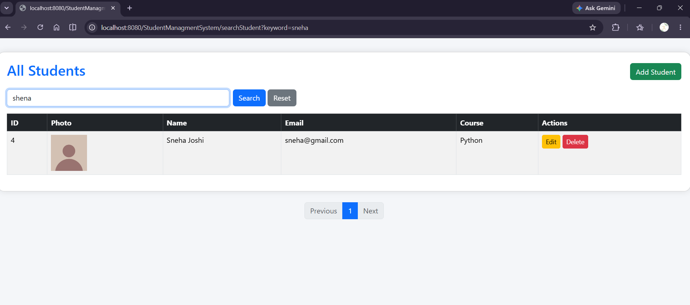
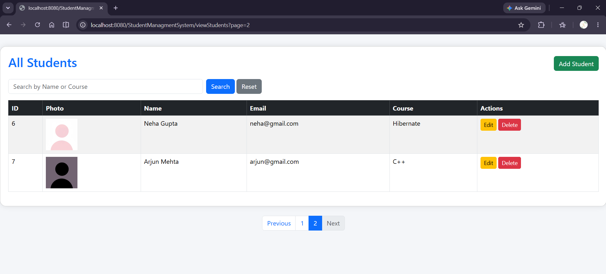

# 🎓 Student Management System

A web-based **Student Management System** developed using **Java, JSP, Servlets, JDBC, PostgreSQL, and Apache Tomcat**. The application allows users to manage student records efficiently with complete CRUD operations, search functionality, image upload, and pagination.

---

## 🚀 Features

- ➕ Add New Student
- 📋 View All Students
- ✏️ Update Student Details
- 🗑️ Delete Student
- 🔍 Search Students by Name or Course
- 📷 Upload Student Photo
- 📄 Pagination for Student Records
- 🗄️ PostgreSQL Database Integration
- 🎨 Responsive User Interface using Bootstrap

---

## 🛠️ Technologies Used

- Java
- JSP (Java Server Pages)
- Servlets
- JDBC
- PostgreSQL
- Apache Tomcat 10
- Bootstrap 5
- HTML5
- CSS3
- Git & GitHub

---

## 📂 Project Structure

```text
StudentManagementSystem
│
├── src
│   ├── controller
│   ├── DAO
│   ├── daoImpl
│   ├── model
│   └── util
│
├── webapp
│   ├── jsp
│   ├── css
│   ├── images
│   └── WEB-INF
│
└── pom.xml
```

---

## 🗃️ Database

### Database Name

```text
student_db
```

### Table Name

```text
students
```

### Columns

| Column | Type |
|---------|------|
| student_id | Integer (Primary Key) |
| first_name | VARCHAR |
| last_name | VARCHAR |
| email | VARCHAR |
| phone | VARCHAR |
| gender | VARCHAR |
| course | VARCHAR |
| address | TEXT |
| photo | VARCHAR |

---

## ⚙️ How to Run the Project

### 1. Clone the Repository

```bash
git clone https://github.com/kalpana23019/student-management-system.git
```

### 2. Open the Project

Import the project into IntelliJ IDEA or Eclipse.

### 3. Create the Database

Create a PostgreSQL database named:

```text
student_db
```

Create the `students` table with the required columns.

### 4. Configure Database Connection

Update your database credentials in:

```text
src/util/DBConnection.java
```

Example:

```java
String url = "jdbc:postgresql://localhost:5432/student_db";
String username = "postgres";
String password = "your_password";
```

### 5. Configure Apache Tomcat

- Install Apache Tomcat 10
- Add Tomcat Server in IntelliJ IDEA/Eclipse
- Deploy the project

### 6. Run the Application

Open your browser and visit:

```text
http://localhost:8080/StudentManagmentSystem/
```

---

## 📸 Screenshots

### Dashboard


### Add Student


### View Students


### Edit Student


### Search Student


### Pagination


---

## 📚 Learning Outcomes

This project helped me understand:

- MVC Architecture
- Java Servlets
- JSP
- JDBC CRUD Operations
- File Upload using Servlet
- PostgreSQL Integration
- Pagination
- Search Functionality
- Git & GitHub
- Bootstrap UI Design

---

## 👩‍💻 Author

**Kalpana Patil**

GitHub: https://github.com/kalpana23019


